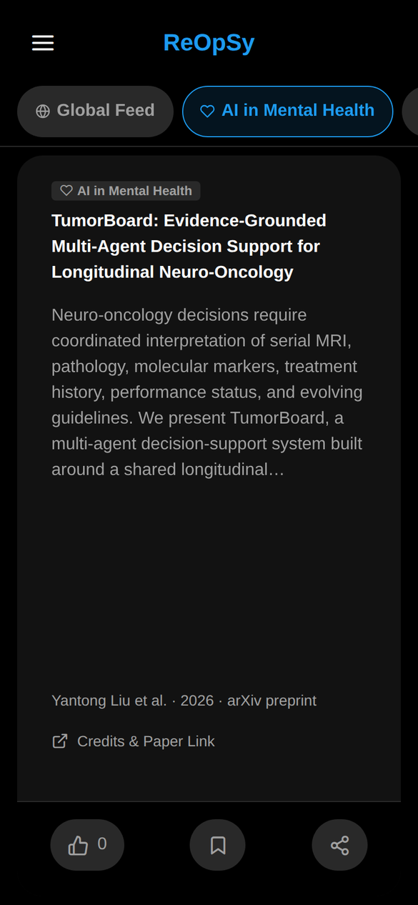
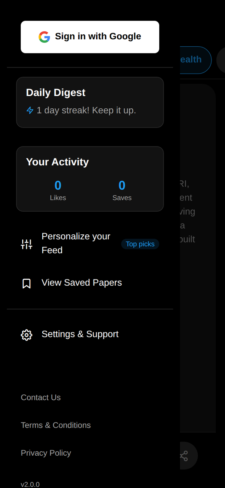
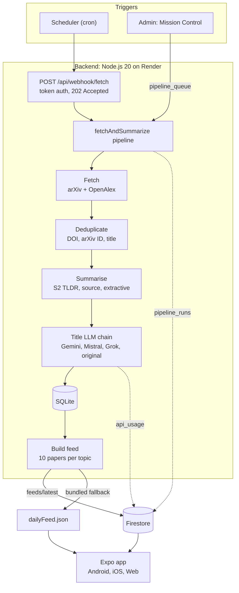

<div align="center">


# ReOpSy

**Research, one swipe at a time.**

A mobile-first app that turns the newest arXiv and OpenAlex papers in your field into a short daily deck of plain-language flashcards, powered by a deduplicating ingestion pipeline and an LLM layer that degrades gracefully.

[](https://github.com/sundram-tiwari/ReOpSy/actions/workflows/ci.yml)


**[Live web demo](https://reopsy-frontend.onrender.com)** · [Architecture](#architecture) · [Design decisions](#design-decisions) · [Run it locally](#run-it-locally)

</div>

---

## The problem

Thousands of new papers appear on arXiv every week. Researchers either drown in feeds or miss the work that matters. ReOpSy picks a small, fresh, deduplicated set of papers per research topic every day and shows each one as a flashcard: a short title, a summary of at most 80 words, authors, venue, and a link to the source.

<p align="center">
  
  &nbsp;&nbsp;&nbsp;
  
</p>

## Highlights

| | |
|---|---|
| **Multi-source ingestion** | arXiv and OpenAlex queried per topic over the last 30 days; OpenAlex records dated in the future are dropped |
| **Cross-source deduplication** | Records matched by DOI, then arXiv ID, then normalised title; the most complete record wins and absorbs the other's fields, with licence-aware merging of abstracts |
| **Hallucination-safe summaries** | Semantic Scholar TLDR, then the source summary, then an extractive summariser whose every word comes from the abstract; hard 80-word budget |
| **LLM with graceful degradation** | Titles generated by Gemini (2.5, 1.5, 2.0 Flash), falling back to Mistral Small, then Grok 3 Mini, then the original title; system prompt editable at runtime |
| **Observability** | Every LLM call logged (provider, model, success, token count) with credentials redacted; every pipeline run logged with per-topic counts, status and duration |
| **Admin "Mission Control"** | Flashcard curation, pipeline trigger queue, run history, LLM usage view and prompt editor, behind an admin whitelist |
| **Security** | Least-privilege Firestore rules (owner-only user data, admin-only config and logs); token-authenticated trigger endpoint |
| **Tested** | 65 backend tests and 54 app logic tests on Node's built-in test runner; backend suite runs in CI on every push |

## Architecture



The pipeline runs asynchronously behind the webhook, so a scheduler call returns `202 Accepted` immediately instead of timing out. The app reads the latest feed from Firestore and falls back to the feed bundled at build time, so it works offline and without any account.

## Design decisions

- **Extractive over abstractive summaries.** An abstractive model can invent claims, and inventing claims about someone else's paper is the one failure this app cannot afford. The extractive summariser scores sentences by term frequency, title overlap, position and claim cues ("we propose", "results show"), then re-emits them in their original order.
- **The LLM only touches the title.** Titles are low-risk and high-impact for engagement; the summary stays grounded in the source text.
- **Degrade, never fail.** Each layer has a fallback: LLM provider chain down to the original title, summary chain down to extractive, a placeholder card instead of an empty feed, and a bundled feed when the network or Firebase is unavailable.
- **Deterministic deduplication.** The same paper often appears three times (arXiv preprint, OpenAlex preprint record, OpenAlex published record). Keys are tried in order of confidence, and ties are broken by completeness, then citations, then a stable id comparison.
- **Polite API usage.** A 3 s pause between arXiv calls and 600 ms between Semantic Scholar calls keeps the pipeline inside public rate limits.
- **Secrets never reach logs.** API keys, bearer tokens and basic-auth headers are redacted before any error is stored.

## Run it locally

**Prerequisites:** Node.js 20 or newer and npm. Firebase and LLM keys are optional: without them the app runs offline on the bundled feed and the pipeline keeps original titles.

**App (Android, iOS, Web)**

```bash
cd app
npm ci
npx expo start        # scan the QR code with Expo Go, or press "w" for the web build
```

For live mode, copy `app/.env.example` to `app/.env` and fill in your Firebase web config.

**Backend pipeline**

```bash
cd backend
npm ci
cp .env.example .env                        # LLM keys and Firebase service account, all optional
npm test                                    # 65 tests, about a second
node pipeline/fetchAndSummarize.js --dry    # fetch and deduplicate only, no writes, no LLM calls
npm start                                   # webhook server on :3000, health check at GET /health
```

Trigger a full run locally:

```bash
curl -X POST -H "Authorization: Bearer $WEBHOOK_SECRET" http://localhost:3000/api/webhook/fetch
```

**Deploy.** `render.yaml` is a Render Blueprint with two services: a static web export of the app and the Node.js webhook service, which gets a generated `WEBHOOK_SECRET`.

## Tests

```bash
cd backend && npm test       # 65 unit and integration tests: adapters, dedup, summariser, text utils, webhook
cd app && npm test           # strict TypeScript compile plus 54 logic tests: streaks, dates, deck, BibTeX export
node tests/run_all_e2e.js    # tiered end-to-end suite: features, boundaries, combinations, workloads
```

## Project structure

```
ReOpSy/
├── app/                    Expo + TypeScript app (Android, iOS, Web)
│   └── src/                screens, navigation, Firebase and feed services, pure logic with tests
├── backend/
│   ├── pipeline/           daily pipeline: fetch, deduplicate, summarise, LLM titles, feed
│   ├── ingest/             source adapters (arXiv, OpenAlex), dedup, summariser, tests
│   ├── db/                 SQLite store
│   └── server.js           webhook and health endpoints
├── tests/                  tiered end-to-end and adversarial suites
├── legal/                  privacy policy, terms, disclaimer, takedown policy
├── docs/screenshots/       README images
├── firestore.rules         least-privilege security rules
└── render.yaml             Render Blueprint (web export and backend)
```

The first version stored papers in Supabase through a nightly GitHub Actions job (`backend/ingest/ingest.js`, `backend/schema.sql`). That path is kept for reference and can still be run manually from the Actions tab.

## Roadmap

- Measure topic precision on a labelled sample of cards per topic and tighten ambiguous queries
- Automatic faithfulness check for generated titles (entailment against the abstract) before publishing
- A small human-rated evaluation set to compare LLM providers and prompt versions
- Personalised ranking from likes and saves

## Author

**Sundram Tiwari**, PhD Research Scholar, IIIT Allahabad · [LinkedIn](https://www.linkedin.com/in/sundram-tiwari) · [GitHub](https://github.com/sundram-tiwari)

## License

© 2026 Sundram Tiwari. All rights reserved. The source is public for portfolio and review purposes; no licence to reuse it is granted. The app's user-facing terms are in [`legal/`](legal/).
